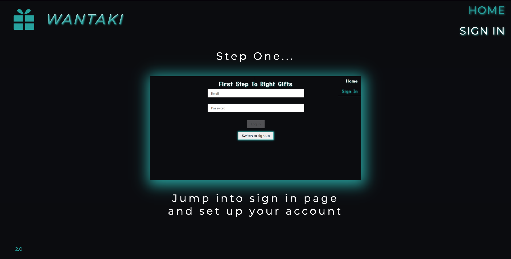

# WANTAKI app!
A cool and useful app which was in my head for many months waiting for me to acquire adequate skills ;). I will be using it for sure and I think many people will find it useful as well.
The basic idea is simple, you have to create your account then a list of items you would like to have, and the last step is to share this list with other people like your family and friends. This way you will never again receive missed gifts.

## Additional features to implement:
- pagination
- possibility to create collections of items
- other color themes
- reset password
- google login
- possibiity to add images to our items

## Check Here ==> https://whatuwant.netlify.app/

## Wantaki

## Technologies
* React, Redux, Firebase

## Contact
Created by Jakub Folta [@folta.me](https://www.folta.me/) - feel free to contact me! 
